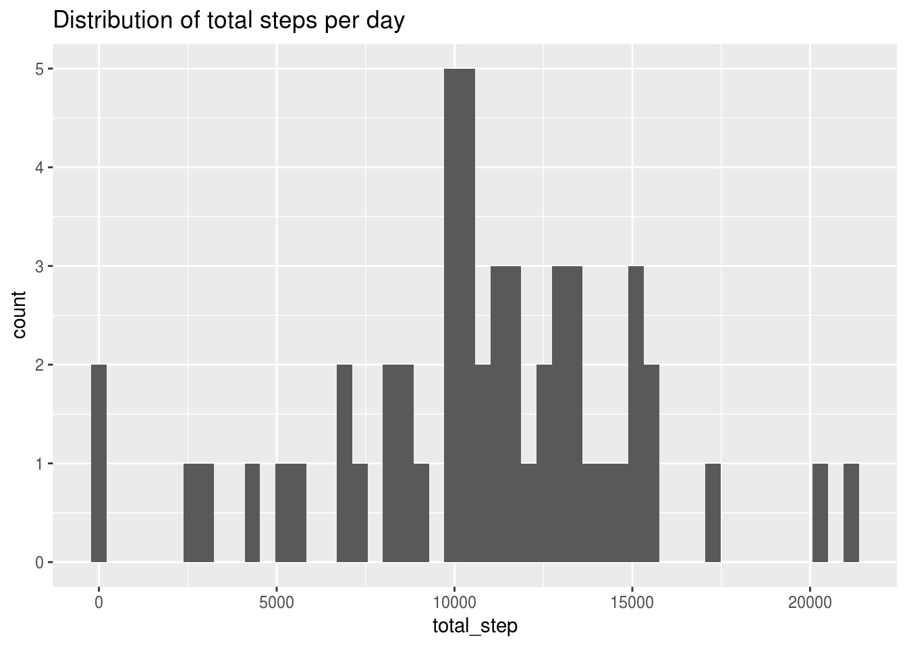
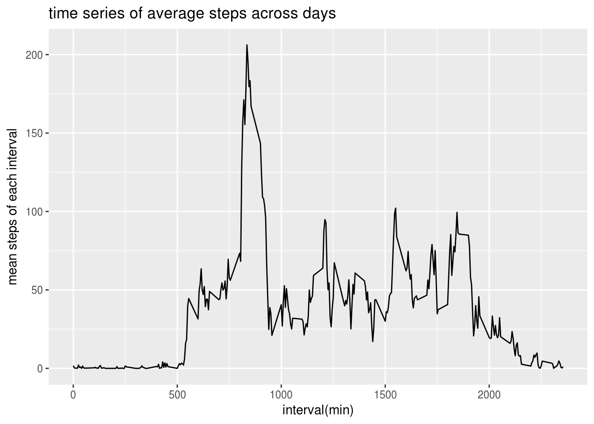
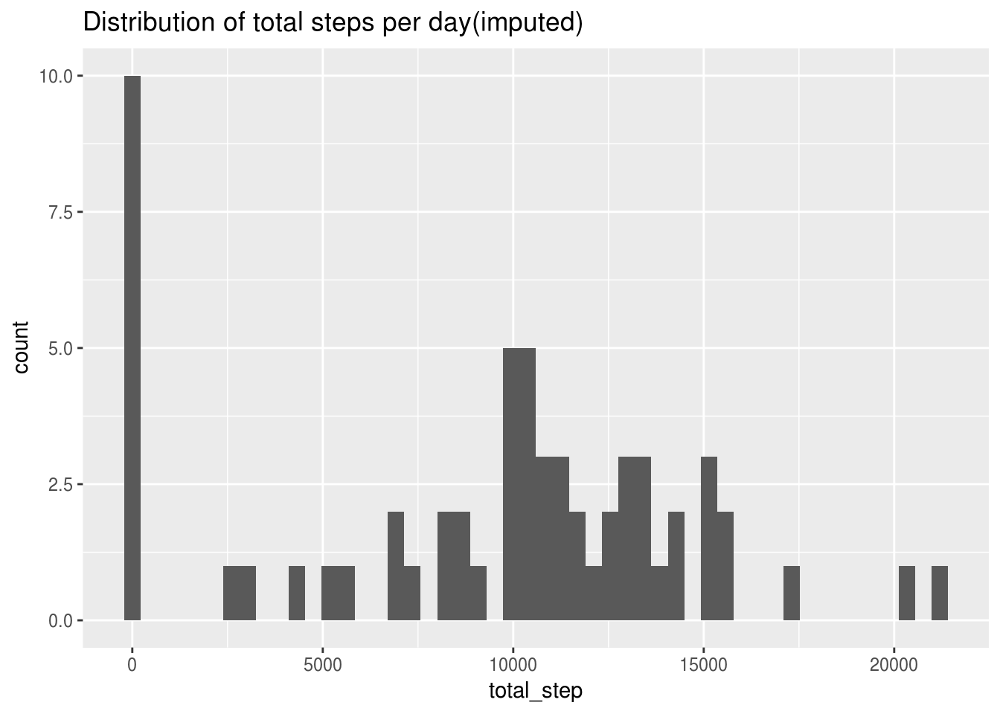
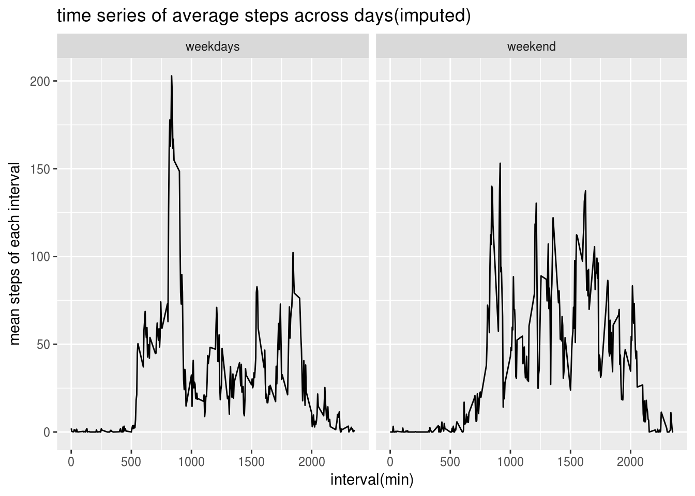

###Load the data

```r
setwd("/home/ni/Coursera/reproducible research")
#read data to R 
activity <- read.csv(file="activity.csv", header=TRUE)
```
###What is mean total number of steps taken per day?
Make a histogram of the total number of steps taken each day

```r
#calculate the total number of steps each day
steps_date <- activity %>% 
              filter(!is.na(steps)) %>% 
              group_by(date)%>%
              summarise(total_step=sum(steps))

ggplot(data=steps_date, aes(total_step))+ geom_histogram(bins=50)+ggtitle("Distribution of total steps per day")
```




```r
#the mean of total steps per day
steps_date_mean <- mean(steps_date$total_step)
steps_date_mean
```

```
## [1] 10766.19
```

```r
#the median of total steps per day
steps_date_median <- median(steps_date$total_step)
steps_date_median 
```

```
## [1] 10765
```

###What is the average daily activity pattern?
Make a time series plot of the 5-minute interval (x-axis) and the average number of steps taken, averaged across all days (y-axis)

```r
time_series_steps <- activity %>% 
              filter(!is.na(steps)) %>% 
              group_by(interval) %>%
              summarise(mean_step_interval=mean(steps))

ggplot(data=time_series_steps,aes(interval,mean_step_interval))+
    geom_line()+
    labs(x="interval(min)",y="mean steps of each interval",title="time series of average steps across days")
```



Which 5-minute interval, on average across all the days in the dataset, contains the maximum number of steps?

```r
interval_max <- time_series_steps %>% filter(mean_step_interval==max(mean_step_interval))
interval_max
```

```
## # A tibble: 1 x 2
##   interval mean_step_interval
##      <int>              <dbl>
## 1      835           206.1698
```


###Imputing missing values
Calculate and report the total number of missing values in the dataset (i.e. the total number of rows with NAs)

```r
num_na_steps <- activity %>% filter(is.na(steps)) %>% nrow()
num_na_steps
```

```
## [1] 2304
```

Devise a strategy for filling in all of the missing values in the dataset. The strategy does not need to be sophisticated. For example, you could use the mean/median for that day, or the mean for that 5-minute interval, etc.

Install imputeMissings package and use its function to filling the missing values,the values added are the median number of steps of each day 

```r
library(imputeMissings)
activity_impute <- impute(activity)
```
activity_impute is the new dataset that is equal to the original dataset but with the missing data filled in.

Make a histogram of the total number of steps taken each day and Calculate and report the mean and median total number of steps taken per day. 
Do these values differ from the estimates from the first part of the assignment? What is the impact of imputing missing data on the estimates of the total daily number of steps?

```r
#calculate the total number of steps each day
steps_date_impute <- activity_impute %>% 
              filter(!is.na(steps)) %>% 
              group_by(date)%>%
              summarise(total_step=sum(steps))

steps_date_mean_impute <- mean(steps_date_impute$total_step)
steps_date_median_impute <- median(steps_date_impute$total_step)

#find the difference between mean and median of the original and imputed data
difference_mean <- steps_date_mean - steps_date_mean_impute
difference_mean
```

```
## [1] 1411.959
```

```r
difference_median <- steps_date_median -steps_date_median_impute
difference_median
```

```
## [1] 370
```
From the above we can see that imputation decreased the mean as well as median of total number of steps


```r
ggplot(data=steps_date_impute, aes(total_step))+ geom_histogram(bins=50)+ggtitle("Distribution of total steps per day(imputed)")
```


The imputed data are all concentrated at 0 steps. 


###Are there differences in activity patterns between weekdays and weekends?
For this part the weekdays() function may be of some help here. Use the dataset with the filled-in missing values for this part.

Create a new factor variable in the dataset with two levels -- "weekday" and "weekend" indicating whether a given date is a weekday or weekend day.


```r
#make a new variable to indicate whether it is weekdays or weekend
activity_weekdays <-  activity_impute %>%
                      mutate(weekday_date=weekdays(as.Date(date))) %>% 
                      mutate(weekday_type = ifelse(weekday_date %in% c("Saturday","Sunday"),"weekend","weekdays"))
                      
                      
#subset weekdays and calculate the mean steps of each interval across all weekdays 
time_series_steps_weekdays <- activity_weekdays %>% filter(weekday_type=="weekdays") %>%
              filter(!is.na(steps)) %>% 
              group_by(interval) %>%
              summarise(mean_step_interval=mean(steps)) %>% 
              mutate(type="weekdays")
#subset weekend and calculate the mean steps of each interval across all weekend  
time_series_steps_weekend <- activity_weekdays %>% filter(weekday_type=="weekend") %>%
              filter(!is.na(steps)) %>% 
              group_by(interval) %>%
              summarise(mean_step_interval=mean(steps)) %>% 
              mutate(type="weekend") 

#combine the above two dataset together for plotting 
time_series_stpes_weekdays_weekend <- rbind(time_series_steps_weekdays,time_series_steps_weekend)
```

Make a panel plot containing a time series plot (i.e. type = "l") of the 5-minute interval (x-axis) and the average number of steps taken, averaged across all weekday days or weekend days (y-axis). The plot should look something like the following, which was created using simulated data:

```r
ggplot(data=time_series_stpes_weekdays_weekend,aes(interval,mean_step_interval))+
    geom_line()+
    facet_grid(~ type)+
    labs(x="interval(min)",y="mean steps of each interval",title="time series of average steps across days(imputed)")
```


Yes, there is difference in activity patterns between weekdays and weekend.The activity in weekends have a more evenly distribution but in weekdays more it is more concentrated around 800 min interval. 


